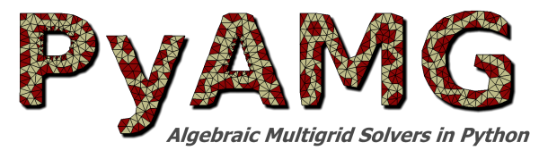
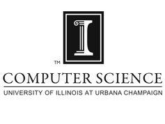

[](https://travis-ci.org/pyamg/pyamg)
[](https://codecov.io/gh/pyamg/pyamg)
[](https://pypi.python.org/pypi/pyamg/)
[](https://pypi.python.org/pypi/pyamg/)

# Installation
PyAMG requires `numpy` and `scipy`

      pip install pyamg

or

      python setup.py install


# Introduction

PyAMG is a library of **Algebraic Multigrid (AMG)** solvers with a convenient Python interface.




PyAMG is developed by **[Nathan Bell](http://graphics.cs.uiuc.edu/~wnbell/)**, **[Luke Olson](http://lukeo.cs.illinois.edu)**, and **[Jacob Schroder](http://people.llnl.gov/schroder2)**, in the **[Deparment of Computer Science](http://www.cs.uiuc.edu)** at the **[University of Illinois at Urbana-Champaign](http://www.illinois.edu)**.  Portions of the project were partially supported by the [NSF](http://www.nsf.gov) under award DMS-0612448.


# Citing

<pre>
@MISC{BeOlSc2011,
      author = "Bell, W. N. and Olson, L. N. and Schroder, J. B.",
      title = "{PyAMG}: Algebraic Multigrid Solvers in {Python} v3.0",
      year = "2015",
      url = "http://www.pyamg.org",
      note = "Release 3.0"
      }
</pre>

# Getting Help

Creat an [issue](https://github.com/pyamg/pyamg/issues).

Look at the [Tutorial](https://github.com/pyamg/pyamg/wiki/Tutorial) or the [Examples](https://github.com/pyamg/pyamg/wiki/Examples) (for instance  the [0STARTHERE](https://github.com/pyamg/pyamg-examples/blob/master/0STARTHERE/demo.py) example)

# What is AMG?

 AMG is a multilevel technique for solving large-scale linear systems with optimal or near-optimal efficiency.  Unlike geometric multigrid, AMG requires little or no geometric information about the underlying problem and develops a sequence of coarser grids directly from the input matrix.  This feature is especially important for problems discretized on unstructured meshes and irregular grids.

# PyAMG Features

PyAMG features implementations of:

- **Ruge-Stuben (RS)** or *Classical AMG*
- AMG based on **Smoothed Aggregation (SA)**

and experimental support for:

- **Adaptive Smoothed Aggregation (αSA)**
- **Compatible Relaxation (CR)**

The predominant portion of PyAMG is written in Python with a smaller amount of supporting C++ code for performance critical operations.

# Example Usage

PyAMG is easy to use!  The following code constructs a two-dimensional Poisson problem and solves the resulting linear system with Classical AMG.

````python
import pyamg
import numpy as np
A = pyamg.gallery.poisson((500,500), format='csr')  # 2D Poisson problem on 500x500 grid
ml = pyamg.ruge_stuben_solver(A)                    # construct the multigrid hierarchy
print(ml)                                           # print hierarchy information
b = np.random.rand(A.shape[0])                      # pick a random right hand side
x = ml.solve(b, tol=1e-10)                          # solve Ax=b to a tolerance of 1e-8
print("residual: ", np.linalg.norm(b-A*x))          # compute norm of residual vector
````

Program output:

<pre>
multilevel_solver
Number of Levels:     9
Operator Complexity:  2.199
Grid Complexity:      1.667
Coarse Solver:        'pinv2'
  level   unknowns     nonzeros
    0       250000      1248000 [45.47%]
    1       125000      1121002 [40.84%]
    2        31252       280662 [10.23%]
    3         7825        70657 [ 2.57%]
    4         1937        17971 [ 0.65%]
    5          483         4725 [ 0.17%]
    6          124         1352 [ 0.05%]
    7           29          293 [ 0.01%]
    8            7           41 [ 0.00%]

residual:  1.24748994988e-08
</pre>
